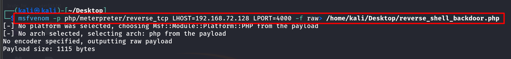
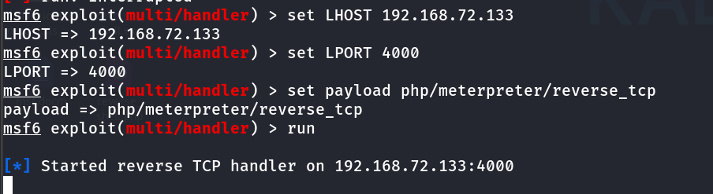
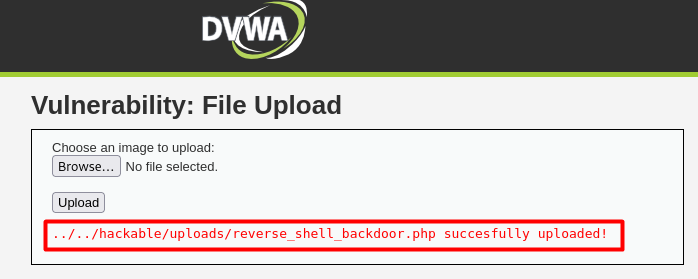
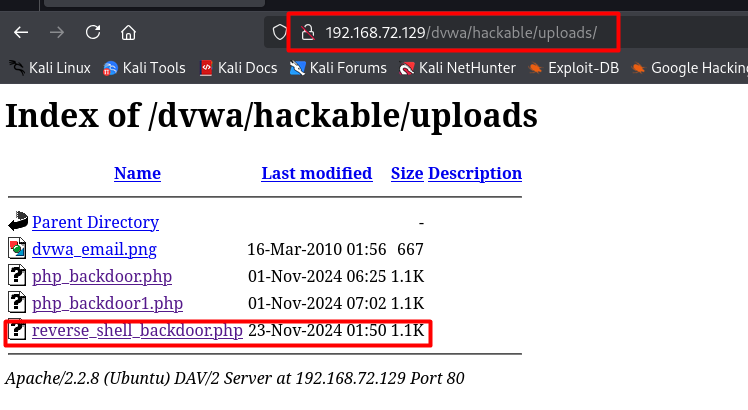
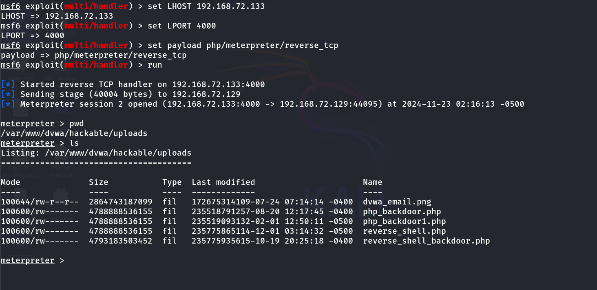

# Reverse-shell-through-File-upload :rocket:

# Introduction

File upload vulnerabilities are a significant security concern in web applications. These vulnerabilities occur when an application allows users to upload files without properly validating their type, size, or content. If left unchecked, malicious files can be uploaded and executed on the server, potentially leading to data breaches, system compromise, or even complete takeover. The Damn Vulnerable Web Application (DVWA) serves as a controlled environment to understand, explore, and mitigate such vulnerabilities. 

# Problem Statement

Web applications often require file upload functionality to allow users to upload documents, images, or other content. However, improper handling and validation of uploaded files can expose the application to severe security risks. Attackers can exploit these vulnerabilities to upload malicious files, such as scripts, which can be executed on the server to:
1. Gain unauthorized access by reverse shell.
2. Execute arbitrary commands.
3. Compromise sensitive data.
4. Deploy malware.
The challenge lies in understanding how these vulnerabilities arise and how they can be mitigated effectively to secure web applications.

# Objective of Project

The primary objectives of this project are:
1.	To understand the file upload functionality and its associated security risks.
2.	To explore the vulnerabilities associated with file uploads using DVWA.
3.	To demonstrate real-world exploitation of file upload vulnerabilities.

# Methodology Adopted

I used two tools for this exploitation that are built-in Kali Linux.
1.	msfvenom – to create malicious payload
2.	msfconsole - to use for exploiting vulnerabilities, managing payloads, and performing penetration testing tasks.

First, I created a malicious backdoor payload using msfvenom where I gave my host Ip address and a port.

Now, I need to configure msfconsole where I set up a listener with my host IP, port and payload. For this, I used multi/handler exploit which is Generic Payload Handler. 

Now I will upload the malicious file to the DVWA server and find out the path where it will be uploaded.

I found the path that uploaded in hackable/uploads folder. Now in the URL I executed this path and found out where that file uploaded.

Now, when I open this file, I have the reverse connection in a meterpreter shell to my host machine where I can perform command execution and get all the information what I need to know. :tada:

Now let's talk about the mitigation process of this vulnerability.

# Mitigation of File Upload Vulnerability

1.	Validate File Type and Content: Use a whitelist for file types and validate MIME types, not just extensions.
2.	Limit File Size and Paths: Restrict file size and store uploads outside the web root.
3.	Rename and Sanitize: Rename files with unique names and sanitize file names to prevent exploits.
4.	Server-Side Validation: Enforce strict validation on the server for type, size, and content.
5.	Restrict Permissions and Use CSP: Set non-executable permissions for upload directories and apply Content Security Policies.
These steps ensure better protection against file upload exploits.

